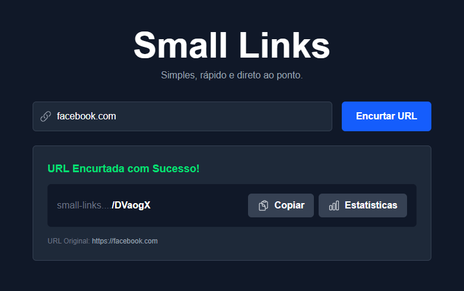

# Small Links

[](https://small-links-apolinario0x21.netlify.app/)
[](https://github.com/apolinario0x21/small-links-web/blob/main/LICENSE)


Um encurtador de URLs moderno, simples e eficiente construído com Next.js, TypeScript e TailwindCSS.

## 📋 Sobre o Projeto
Small Links é uma aplicação web que permite aos usuários encurtar URLs longas de forma rápida e intuitiva. Com uma interface clean e moderna, o projeto oferece funcionalidades essenciais como monitoramento de estatísticas de acesso e status da API em tempo real.




## ✨ Funcionalidades

- Encurtamento de URLs: Transforme links longos em URLs curtas e fáceis de compartilhar
- Validação Automática: Adiciona automaticamente https:// quando necessário
- Cópia Rápida: Botão para copiar a URL encurtada com feedback visual
- Estatísticas: Visualize dados de acesso, data de criação e URL original
- Status da API: Monitoramento em tempo real do status da API
- Interface Responsiva: Design adaptável para desktop e mobile
- Animações Suaves: Transições e feedbacks visuais elegantes

## 🛠️ Tecnologias Utilizadas

* **[Next.js](https://nextjs.org/)** - Framework React para produção.
* **[React](https://reactjs.org/)** - Biblioteca para construção de interfaces de usuário.
* **[TypeScript](https://www.typescriptlang.org/)** - Superset de JavaScript com tipagem estática.
* **[Tailwind CSS](https://tailwindcss.com/)** - Framework de CSS para estilização rápida.
* **[Heroicons](https://heroicons.com/)** - Ícones SVG de alta qualidade.

## 🚀 Como Usar

1. Acesse a aplicação no seu navegador
2. Digite ou cole a URL que deseja encurtar no campo de entrada
3. Clique em "Encurtar URL" ou pressione Enter
4. Copie a URL encurtada usando o botão de cópia
5. Visualize estatísticas clicando no botão "Estatísticas"

## 📦 Instalação e Configuração
### Pré-requisitos

- Node.js 18+
- npm ou yarn

### Instalação
```bash
# Clone o repositório
git clone https://github.com/apolinario0x21/small-links-web.git

# Navegue para o diretório
cd small-links-web

# Instale as dependências
npm install

# Execute em modo de desenvolvimento
npm run dev
```
A aplicação estará disponível em http://localhost:3000.


## 📡 API Endpoints
A aplicação consome os seguintes endpoints:

- `GET /health` - Status da API e total de URLs
- `GET /shorten?url={url}` - Encurta uma URL
- `GET /stats/{shortId}` - Estatísticas de uma URL específica

## 📱 Responsividade
A aplicação é totalmente responsiva com breakpoints:

- Mobile: < 768px
- Tablet: 768px - 1024px
- Desktop: > 1024px

## 🤝 Contribuição

- Faça um fork do projeto
- Crie uma branch para sua feature (`git checkout -b feature/AmazingFeature`)
- Commit suas mudanças (`git commit -m 'Add some AmazingFeature'`)
- Push para a branch (`git push origin feature/AmazingFeature`)
- Abra um Pull Request

## 📝 Licença
Este projeto está sob a licença MIT. Veja o arquivo [LICENSE](https://github.com/apolinario0x21/small-links-web/blob/main/LICENSE) para mais detalhes.
